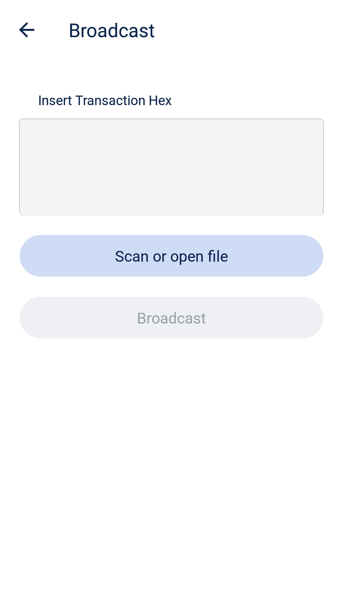
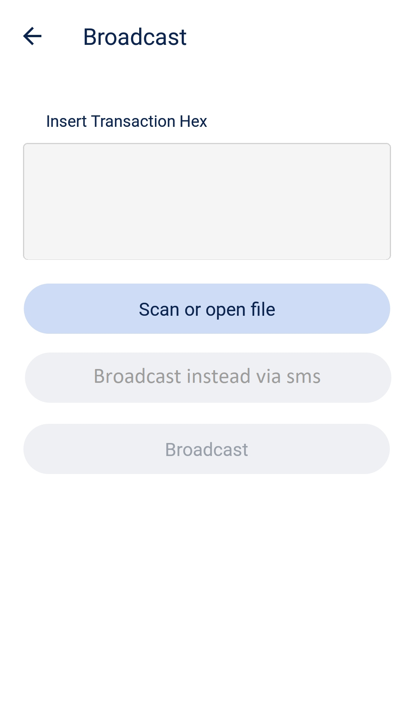

# Ptv-sms proposal for BlueWallet

## What is ptv-sms
Ptv-sms means publish transaction via sms. 
Its a idea were users are able to send their signed Bitcoin transaction via sms towards Bluewallet. 
Bluewallet then publish that transaction hash to the bitcoin network.

## How to implement it into the UI of BW?

 

## What happens when you push the new button
The button should contain a link or function simular to this: 
  &lt;a href="sms:+12345678900?&body=txHash">Broadcast instead via sms &lt;/a>

 When someone now clicks on the new button, their SMS app will be launched with the tx hash as pre-written message.
 The user then only needs to hit send.
